## Kaggle/Dacon 필사
#### 1) Model: Linear Regression (Polynomial)
#### 2) Dataset: Medical Cost Personal Datasets (Kaggle)
#### 3) 목적: 의료보험 비용(charges) 예측 모델링
#### 4) 필사 Code: https://www.kaggle.com/code/mariapushkareva/medical-insurance-cost-with-linear-regression

### 1. EDA and Visualizations


```python
import pandas as pd
import numpy as np
import matplotlib.pyplot as plt
import seaborn as sns
import warnings
warnings.filterwarnings('ignore')
```


```python
df = pd.read_csv('insurance.csv')
df.head()
```


<div>
<style scoped>
    .dataframe tbody tr th:only-of-type {
        vertical-align: middle;
    }

    .dataframe tbody tr th {
        vertical-align: top;
    }

    .dataframe thead th {
        text-align: right;
    }
</style>
<table border="1" class="dataframe">
  <thead>
    <tr style="text-align: right;">
      <th></th>
      <th>age</th>
      <th>sex</th>
      <th>bmi</th>
      <th>children</th>
      <th>smoker</th>
      <th>region</th>
      <th>charges</th>
    </tr>
  </thead>
  <tbody>
    <tr>
      <th>0</th>
      <td>19</td>
      <td>female</td>
      <td>27.900</td>
      <td>0</td>
      <td>yes</td>
      <td>southwest</td>
      <td>16884.92400</td>
    </tr>
    <tr>
      <th>1</th>
      <td>18</td>
      <td>male</td>
      <td>33.770</td>
      <td>1</td>
      <td>no</td>
      <td>southeast</td>
      <td>1725.55230</td>
    </tr>
    <tr>
      <th>2</th>
      <td>28</td>
      <td>male</td>
      <td>33.000</td>
      <td>3</td>
      <td>no</td>
      <td>southeast</td>
      <td>4449.46200</td>
    </tr>
    <tr>
      <th>3</th>
      <td>33</td>
      <td>male</td>
      <td>22.705</td>
      <td>0</td>
      <td>no</td>
      <td>northwest</td>
      <td>21984.47061</td>
    </tr>
    <tr>
      <th>4</th>
      <td>32</td>
      <td>male</td>
      <td>28.880</td>
      <td>0</td>
      <td>no</td>
      <td>northwest</td>
      <td>3866.85520</td>
    </tr>
  </tbody>
</table>
</div>


```python
df.shape
```


    (1338, 7)


```python
df.describe()
```


<div>
<style scoped>
    .dataframe tbody tr th:only-of-type {
        vertical-align: middle;
    }

    .dataframe tbody tr th {
        vertical-align: top;
    }

    .dataframe thead th {
        text-align: right;
    }
</style>
<table border="1" class="dataframe">
  <thead>
    <tr style="text-align: right;">
      <th></th>
      <th>age</th>
      <th>bmi</th>
      <th>children</th>
      <th>charges</th>
    </tr>
  </thead>
  <tbody>
    <tr>
      <th>count</th>
      <td>1338.000000</td>
      <td>1338.000000</td>
      <td>1338.000000</td>
      <td>1338.000000</td>
    </tr>
    <tr>
      <th>mean</th>
      <td>39.207025</td>
      <td>30.663397</td>
      <td>1.094918</td>
      <td>13270.422265</td>
    </tr>
    <tr>
      <th>std</th>
      <td>14.049960</td>
      <td>6.098187</td>
      <td>1.205493</td>
      <td>12110.011237</td>
    </tr>
    <tr>
      <th>min</th>
      <td>18.000000</td>
      <td>15.960000</td>
      <td>0.000000</td>
      <td>1121.873900</td>
    </tr>
    <tr>
      <th>25%</th>
      <td>27.000000</td>
      <td>26.296250</td>
      <td>0.000000</td>
      <td>4740.287150</td>
    </tr>
    <tr>
      <th>50%</th>
      <td>39.000000</td>
      <td>30.400000</td>
      <td>1.000000</td>
      <td>9382.033000</td>
    </tr>
    <tr>
      <th>75%</th>
      <td>51.000000</td>
      <td>34.693750</td>
      <td>2.000000</td>
      <td>16639.912515</td>
    </tr>
    <tr>
      <th>max</th>
      <td>64.000000</td>
      <td>53.130000</td>
      <td>5.000000</td>
      <td>63770.428010</td>
    </tr>
  </tbody>
</table>
</div>


```python
df.dtypes
```


    age           int64
    sex          object
    bmi         float64
    children      int64
    smoker       object
    region       object
    charges     float64
    dtype: object


```python
df.isnull().sum()
```


    age         0
    sex         0
    bmi         0
    children    0
    smoker      0
    region      0
    charges     0
    dtype: int64


#### ▶ y변수 분포 확인


```python
sns.set(style='whitegrid')
sns.displot(df['charges'], kde = True, color= 'c', height=6, aspect=1.5) # kde: 커널 밀도(분포를 매끄러운 곡선으로), c: 청록(cyan), aspect: 가로세로비율
plt.title('Distribution of Charges')
plt.show()
```


    
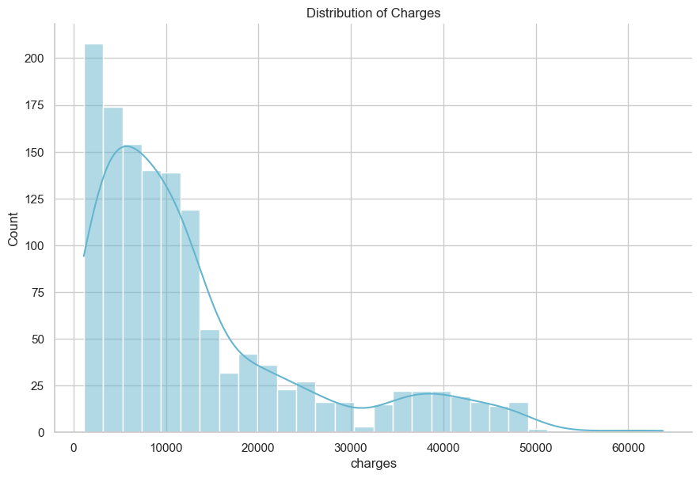
    


#### right-skewed 분포이므로 로그 변환을 통해 정규분포에 가깝게 만들 수 있음.


```python
sns.displot(np.log10(df['charges']), kde= True, color='r', height=6, aspect=1.5)
plt.title('Distribution of Charges(log)')
plt.show()
```


    
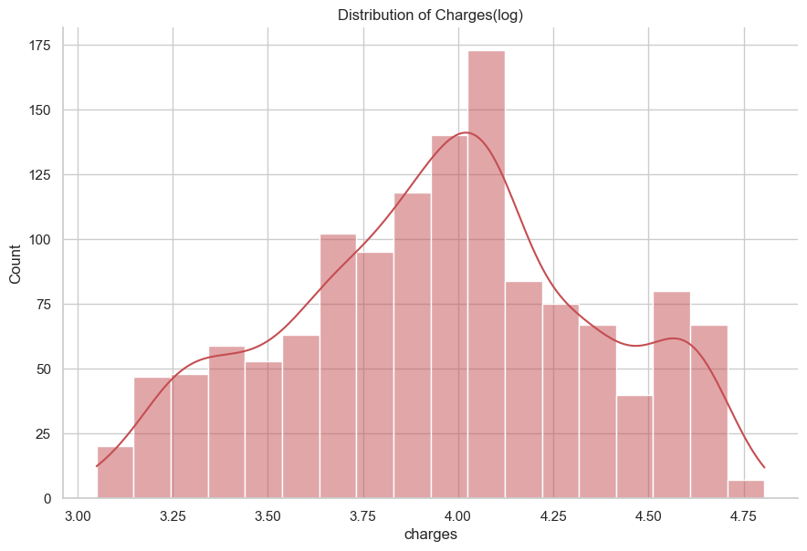
    


#### ▶ 지역(region)에 따른 비용(Charges)


```python
charges = df['charges'].groupby(df.region).sum().sort_values(ascending=True) #지역별 비용 합계를 오름차순으로 정렬
f, ax = plt.subplots(1, 1, figsize=(10,6))
sns.barplot(x=charges.head(), y=charges.head().index, palette='Blues') #최신 버전에서는 x, y 명시 필요
plt.title('Charges by Region')
plt.show()
```


    
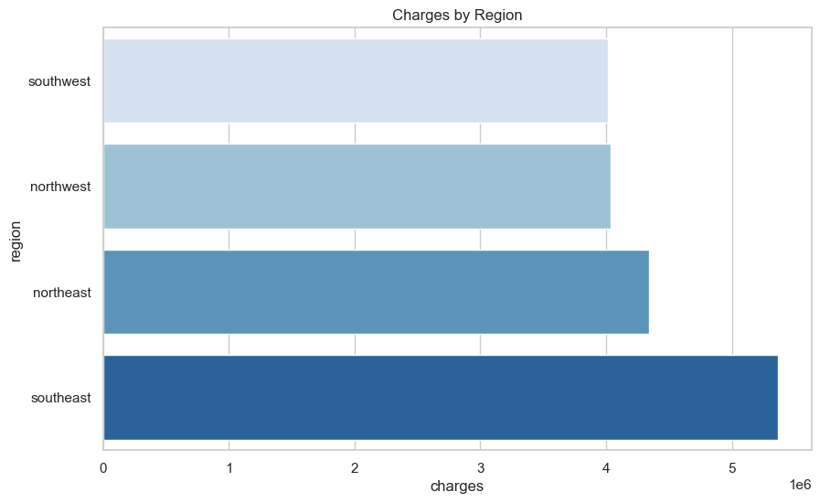
    


#### 비용이 가장 높은 지역은 southeast, 가장 낮은 지역은 southwest임. 어떤 요인에 따라 지역별로 비용이 변하는지 더 살펴보고자 함.

#### ▶ 성별에 따른 지역(region)별 비용(Charges)


```python
f, ax = plt.subplots(1, 1, figsize=(10, 6))
sns.barplot(x='region', y='charges', hue='sex', data=df, palette='cool')
plt.title('Charges by Region and Sex')
plt.show()
```


    
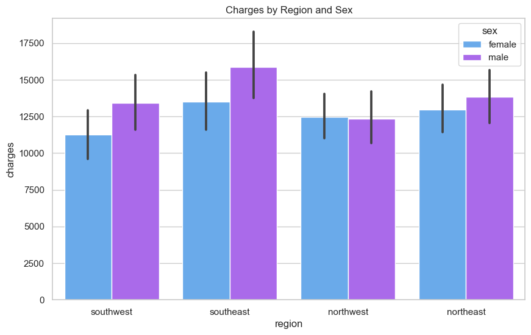
    


#### ▶ 흡연 여부에 따른 지역(region)별 비용(Charges)


```python
f, ax = plt.subplots(1, 1, figsize=(10,6))
sns.barplot(x='region', y='charges', hue='smoker', data=df, palette='Reds_r')
plt.title('Charges by Region and smoker')
plt.show()
```


    
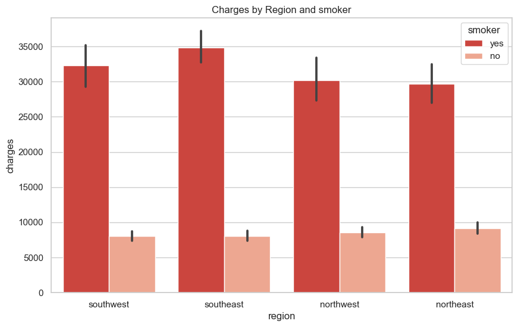
    


#### ▶ 자녀 수에 따른 지역(region)별 비용(Charges)


```python
f, ax = plt.subplots(1, 1, figsize=(12, 8))
sns.barplot(x='region', y='charges', hue='children', data=df, palette='Set1')
plt.title('Charges by Region and children')
plt.show()
```


    
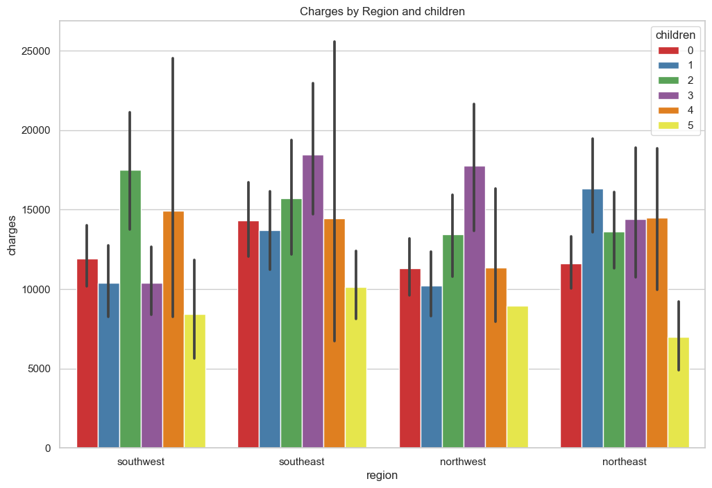
    


#### 전체 결과에서 비용이 가장 높은 지역은 southeast, 가장 낮은 지역은 southwest였음.
#### 1) northeast는 성별에 따라 southwest와 northwest보다 전반적으로 더 높은 비용
#### 2) 전체 결과와 동일하게 흡연(yes)에 따라 가장 높은 비용으로 나타내는 지역은 southeast임. 
#### 반면, 흡연(yes)에 따라 가장 낮은 비용으로 나타나는 지역은 northeast임.
#### 3) 자녀가 있는 사람들이 전반적으로 더 높은 비용으로 나타남.

#### ※ 따라서, 흡연 여부에 따라 변수별 의료비 확인하고자 함.
#### ▶ 흡연여부에 따라 나이, BMI, 자녀 수에 따른 비용


```python
sns.lmplot(x='age', y='charges', data=df, hue='smoker', palette='Set1')
sns.lmplot(x='bmi', y='charges', data=df, hue='smoker', palette='Set2')
sns.lmplot(x='children', y='charges', data=df, hue='smoker', palette='Set3')
plt.show()
```


    
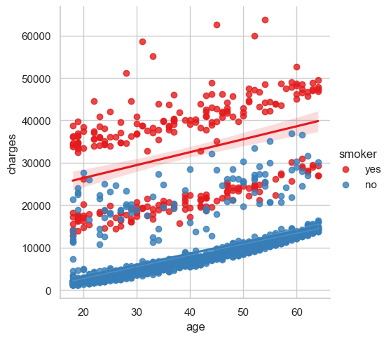
    


    
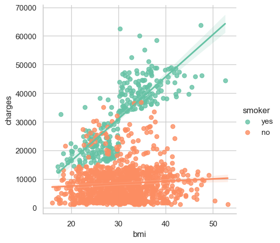
    


    
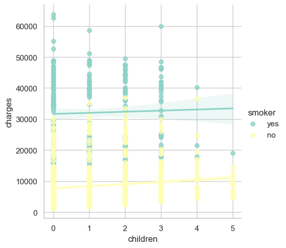
    


##### ※ lmplot이란?
##### 회귀선을 포함한 산점도를 그려주는 함수

#### 위 lmplot를 통해 2가지 결과를 알 수 있음.
#### (1) 나이, BMI, 자녀 수에 따라 비용은 증가함. 
#### (2) 자녀가 있는 사람들은 일반적으로 흡연을 덜 함.


```python
f, ax = plt.subplots(1, 1, figsize=(10,8))
sns.violinplot(x = 'children', y='charges', data=df, orient='v', hue='smoker', palatte='inferno')
plt.show()
```


    
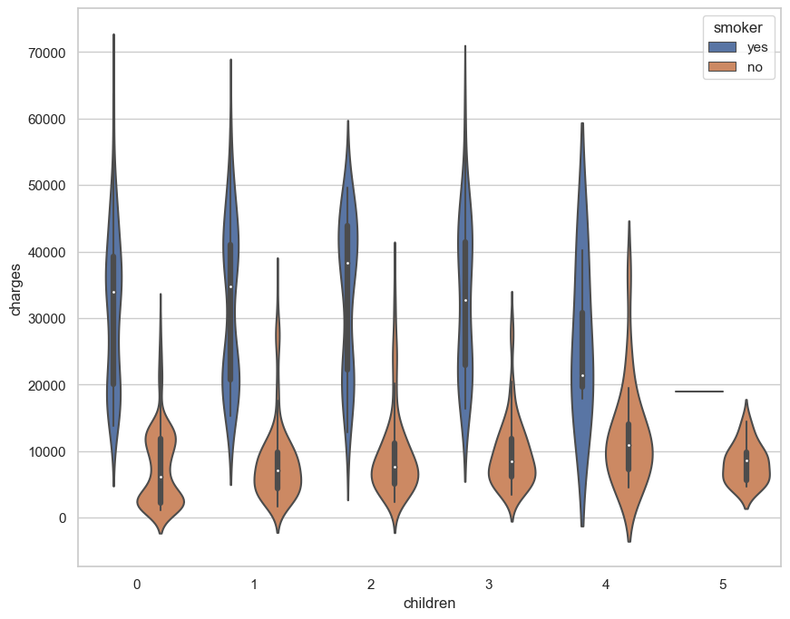
    


### 2. 데이터 타입 변경 및 인코딩


```python
df[['sex', 'smoker', 'region']] = df[['sex', 'smoker', 'region']].astype('category')
df.dtypes
```


    age            int64
    sex         category
    bmi          float64
    children       int64
    smoker      category
    region      category
    charges      float64
    dtype: object


```python
from sklearn.preprocessing import LabelEncoder
label = LabelEncoder()

label.fit(df.sex.drop_duplicates()) #중복 제거된 고유 범주만 학습하게끔
df.sex = label.transform(df.sex)

label.fit(df.smoker.drop_duplicates())
df.smoker = label.transform(df.smoker)

label.fit(df.region.drop_duplicates())
df.region = label.transform(df.region)

df.dtypes
```


    age           int64
    sex           int32
    bmi         float64
    children      int64
    smoker        int32
    region        int32
    charges     float64
    dtype: object


```python
f, ax =plt.subplots(1, 1, figsize=(10,10))
sns.heatmap(df.corr(), annot=True, cmap='cool') #annot: 각 셀에 값(상관계수) 표시
plt.show()
```


    
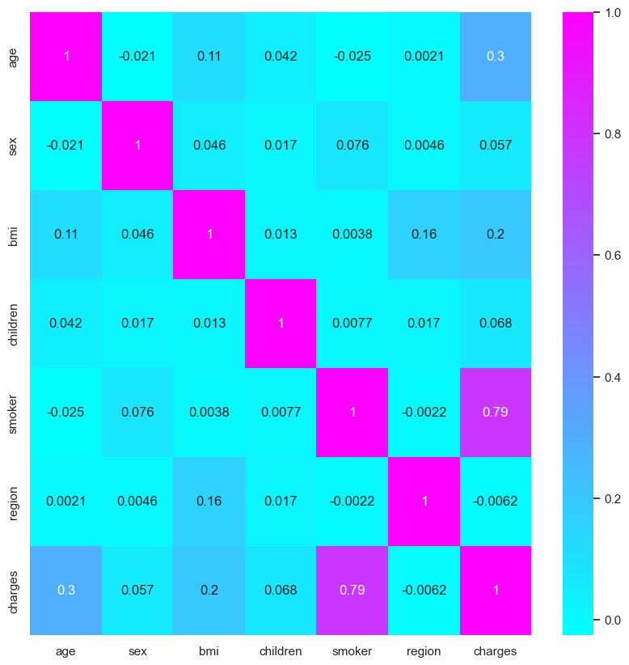
    


#### 상관계수 높은 것 없음(smoker-charges는 y변수와의 관계니까 제외)

### 3. 모델링
#### 1) Linear Regression

##### (1) 언제 사용하는 모델인가?
##### - 데이터가 선형적이고 모델이 단순하고 해석하기 쉬운 결과를 제공할 때 유용
##### (2) 어떤 특징을 가지는가?
##### - 가정: 데이터가 선형적 관계, 독립 변수들 간 다중공선성이 없고, 잔차가 정규분포를 따른다는 가정
##### - 과적합: 과적합 위험 적음.
##### - 해석 용이성: 계수의 크기와 방향으로 각 피처의 영향을 쉽게 해석할 수 있음
##### (3) LinearRegression(fit_intercept=True, normalize='deprecated', copy_X=True, n_jobs=None)
##### - fit_intercept: True면 절편을 모델에 포함, False면 데이터가 원점 지나는 것으로 가정
##### - normalize: True면 정규화 수행하지만 scikit-learn 0.24.0 이후로는 사용되지 않고, StandardScaler 사용 권장


```python
from sklearn.model_selection import train_test_split as holdout
from sklearn.linear_model import LinearRegression
from sklearn import metrics

x = df.drop(['charges'], axis=1) #y값 제외
y = df['charges']

x_train, x_test, y_train, y_test = holdout(x, y, test_size=0.2, random_state=0)
Lin_reg = LinearRegression()
Lin_reg.fit(x_train, y_train)

print(Lin_reg.intercept_)
print(Lin_reg.coef_)
print(Lin_reg.score(x_test, y_test)) #결정계수 R^2
```

    -11661.983908824417
    [  253.99185244   -24.32455098   328.40261701   443.72929547
     23568.87948381  -288.50857254]
    0.7998747145449959
    


```python
# 피처 이름과 회귀 계수 매핑
feature_names = x.columns
coefficients = Lin_reg.coef_

for feature, coef in zip(feature_names, coefficients):
    print(f"{feature}: {coef}")
```

    age: 253.99185244136325
    sex: -24.324550982801895
    bmi: 328.40261700607635
    children: 443.7292954698434
    smoker: 23568.87948381291
    region: -288.50857254371476
    

##### 결과 해석:
##### (1) 적합된 회귀식: y = −11661.98 + 253.99x1 − 24.32x2 + 328.40x3 + 443.73x4 + 23568.88x5 − 288.51x6
##### (2) 각각의 coef: 독립변수의 값이 한 단위 증가할 때 종속변수인 'charges'가 해당 coef 단위만큼 증가/감소함
##### (3) 결정계수: 0.799로 비교적 높은 성능으로 나타남.

#### 2) Ridge Regression

##### (1) 언제 사용하는 모델인가?
##### - 피처들 간의 높은 상관관계(다중공선성) 문제가 있을 때 사용
##### - 많은 피처가 있을 때 모델의 과적합을 방지하고자 할 때 사용
##### (2) 어떤 특징을 가지는가?
##### - 정규화: L2 정규화를 사용해서 계수 크기를 작게 만들어 과적합 방지
##### - 패널티: 모델 복잡도에 패널티 부여해서 피처 영향력을 감소시킴.
##### - 매개변수 조정: 정규화 강도 조절하는 하이퍼파라미터(알파)가 필요
##### (3) Ridge(alpha=1.0, fit_intercept=True, normalize='deprecated', copy_X=True, max_iter=None, tol=0.001, solver='auto', random_state=None)
##### - alpha: 정규화 강도 조절(값이 클수록 더 강한 정규화 적용)
##### - fit_intercept: True면 절편을 모델에 포함, False면 데이터가 원점 지나는 것으로 가정
##### - max_iter: 최적화를 위한 최대 반복 횟수, None이면 제한 x
##### - tol: 값이 작을 수록 더 정확한 해를 찾으려고 함


```python
from sklearn.linear_model import Ridge

Ridge = Ridge(alpha=0.5) #정규화 강도 중간 정도 (0인 경우 L2 정규화 항 사라짐)
Ridge.fit(x_train, y_train)

print(Ridge.intercept_)
print(Ridge.coef_)
print(Ridge.score(x_test, y_test))
```

    -11643.440927495829
    [ 2.53893751e+02 -2.15112284e+01  3.28339566e+02  4.44238477e+02
      2.35009674e+04 -2.89027871e+02]
    0.7996989632063141
    

##### 결과 해석:
##### (1) 적합된 회귀식: y = −11643.44 + 253.89x1 − 21.51x2 + 328.34x3 + 444.23x4 + 23500.96x5 − 289.03x6
##### (2) 각각의 coef: 독립변수의 값이 한 단위 증가할 때 종속변수인 'charges'가 해당 coef 단위만큼 증가/감소함
##### (3) 결정계수: 0.799로 비교적 높은 성능으로 나타남.

#### 3) Lasso Regression

##### (1) 언제 사용하는 모델인가?
##### - 중요하지 않은 피처를 제거할 때 사용
##### - 많은 피처가 있을 때 모델의 과적합을 방지하고자 할 때 사용
##### (2) 어떤 특징을 가지는가?
##### - 정규화: L1 정규화를 사용해서 계수의 절대값 합에 패널티 부여
##### - 피처 선택: 불필요한 피처의 계수를 0으로 만들어서 피처 선택이 가능함.
##### - 매개변수 조정: 정규화 강도 조절하는 하이퍼파라미터(알파)가 필요
##### (3) Lasso(alpha=1.0, fit_intercept=True, precompute=False, copy_X=True, max_iter=1000, tol=0.0001, warm_start=False, positive=False, random_state=None, selection='cyclic')
##### - alpha: 정규화 강도 조절(값이 클수록 더 강한 정규화 적용)
##### - fit_intercept: True면 절편을 모델에 포함, False면 데이터가 원점 지나는 것으로 가정
##### - precompute: True면 사전 계산된 Gram 행렬 사용, False면 사용x
##### - max_iter: 최적화를 위한 최대 반복 횟수, 기본값 1000
##### - tol: 값이 작을 수록 더 정확한 해를 찾으려고 함
##### - warm_start: True면 이전 학습에서 학습된 솔루션 사용해서 다음 학습 시작, 기본값은 False
##### - positive: True면 계수가 양수여야 함. 기본값은 False
##### - selection: 피쳐 선택 방법. 'cyclic'은 모든 피처 순차적으로 업데이트, 'random'은 무작위로 업데이트


```python
from sklearn.linear_model import Lasso

Lasso = Lasso(alpha=0.2, fit_intercept=True, #normalize=False, 기존 코드에서는 지원되었으나 현재는 x
              precompute=False, max_iter=1000, tol=0.0001,
              warm_start=False, positive=False,
              random_state=None, selection='cyclic')
Lasso.fit(x_train, y_train)

print(Lasso.intercept_)
print(Lasso.coef_)
print(Lasso.score(x_test, y_test))
```

    -11661.838929039533
    [ 2.53991436e+02 -2.34569821e+01  3.28389438e+02  4.43587436e+02
      2.35676136e+04 -2.88340296e+02]
    0.7998690236224706
    

##### 결과 해석:
##### (1) 적합된 회귀식: y = −11661.84 + 253.99x1 − 23.46x2 + 328.39x3 + 443.59x4 + 23567.61x5 − 288.34x6
##### (2) 각각의 coef: 독립변수의 값이 한 단위 증가할 때 종속변수인 'charges'가 해당 coef 단위만큼 증가/감소함
##### (3) 결정계수: 0.799로 비교적 높은 성능으로 나타남.

#### 4) Random Forest Regressor

##### (1) 언제 사용하는 모델인가?
##### - 비선형 데이터: 피처와 타겟의 관계가 비선형적일 때
##### - 높은 예측 성능: 복잡한 데이터셋에서 높은 예측 성능을 요구할 때
##### - 피처 중요도: 피처 중요도를 평가하고자 할 때
##### (2) 어떤 특징을 가지는가?
##### - 앙상블: 여러 개의 결정 트리를 사용해서 예측 성능 향상
##### - 과적합 방지: 개별 트리가 과적합되더라도 여러 트리를 앙상블하여 과적합 줄임.
##### - 매개변수 조정: 트리 개수, 최대 깊이, 최소 샘플 수 등 여러 하이퍼파라미터 조정할 수 있음.
##### (3)  RandomForestRegressor(n_estimators=100, criterion='squared_error', max_depth=None, min_samples_split=2, min_samples_leaf=1, min_weight_fraction_leaf=0.0, max_features='auto', max_leaf_nodes=None, min_impurity_decrease=0.0, bootstrap=True, oob_score=False, n_jobs=-1,  random_state=1, verbose=0, warm_start=False, ccp_alpha=0.0, max_samples=None)


##### - n_estimators: 결정 트리 수, 기본값 100
##### - criterion: 분할 품질 측정 기준, 기본값 'squared_error'
##### - max_depth: 개별 결정 트리 최대 깊이, 기본값 None
##### - n_jobs: 병렬로 실행할 작업 수, 기본값 None, -1로 하면 모든 프로세서 사용


```python
from sklearn.ensemble import RandomForestRegressor as rfr

x = df.drop(['charges'], axis=1)
y = df.charges
Rfr = rfr(n_estimators=100, criterion='squared_error', random_state=1, n_jobs=-1)
Rfr.fit(x_train, y_train)

x_train_pred = Rfr.predict(x_train)
x_test_pred = Rfr.predict(x_test)

print('MSE train data: %.3f, MSE test data: %.3f' % (metrics.mean_squared_error(x_train_pred, y_train),
                                                     metrics.mean_squared_error(x_test_pred, y_test)))
print('R2 train data: %.3f, R2 test data: %.3f' % (metrics.r2_score(y_train, x_train_pred),
                                                   metrics.r2_score(y_test, x_test_pred)))

#상대적으로 과적합되기 쉬운 모델이라 train/test 성능 비교한 것이 아닐까 추측
```

    MSE train data: 3628893.887, MSE test data: 19730453.910
    R2 train data: 0.975, R2 test data: 0.876
    


```python
plt.figure(figsize=(8,6))
plt.scatter(x_train_pred, x_train_pred - y_train,
            c='gray', marker='o', s=35, alpha=0.5, label='Train data')
plt.scatter(x_test_pred, x_test_pred - y_test,
            c='blue', marker='o', s=35, alpha=0.7, label='Test data')
plt.xlabel('Predicted values')
plt.ylabel('Actual values')
plt.legend(loc='upper right')
plt.hlines(y=0, xmin=0, xmax=60000, lw=2, color='red')
#y=0이고 x는 0~6000까지인 수평선 (예측값이 실제값이 일치할 때의 기준 선), lw는 선 두께
plt.show()
```


    
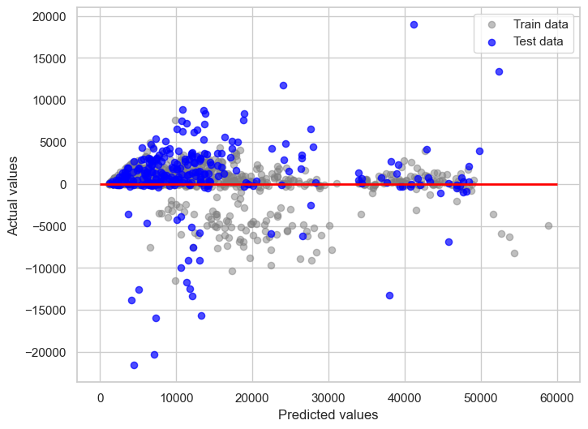
    


```python
print('Feature importance ranking\n\n')
importances = Rfr.feature_importances_

std = np.std([tree.feature_importances_ for tree in Rfr.estimators_], axis=0)
indices = np.argsort(importances)[::-1] #중요도를 내림차순으로 인덱스 배열
variables = ['age', 'sex', 'bmi', 'children', 'smoker', 'region']

importance_list = []
for f in range(x.shape[1]): # shape의 열 개수에 해당하므로 피처의 수
    variable = variables[indices[f]] # 중요도로 정렬한 피처 이름을 가져옴
    importance_list.append(variable) # 피처의 이름을 리스트에 추가
    print("%d.%s(%f)" % (f + 1, variable, importances[indices[f]])) # 피처 중요도 순위 출력

plt.figure()
plt.title("Feature importances")
plt.bar(importance_list, importances[indices],
        color='y', yerr=std[indices], align='center')
plt.show()
```

    Feature importance ranking
    
    
    1.smoker(0.601678)
    2.bmi(0.218831)
    3.age(0.136943)
    4.children(0.020990)
    5.region(0.015165)
    6.sex(0.006393)
    


    

    


```python
#np.argsort 사용 예시
arr = np.array([3, 1, 2])
result = np.argsort(arr)
print(result)
# 3은 원래 배열의 인덱스 0, 1은 원래 배열의 인덱스 1, 2는 원래 배열의 인덱스 2
# 1, 2, 3 순서(오름차순)으로 원래의 인덱스 나열
# 만약, [::-1]를 추가하면 인덱스 배열 뒤집으니까 내림차순이 됨.
```

    [1 2 0]
    

#### 4) Polynomial Regression

#### Polynomial Regression은 별도 모델이 없고, PolynomialFeatures로 다항 피처를 생성한 뒤 LinearRegression 모델을 사용함.
##### (1) 언제 사용하는 모델인가?
##### - 비선형 데이터: 피처와 타겟의 관계가 곡선형일 때
##### - 높은 설명력: 선형 모델이 변동성을 충분히 설명하지 못할 때, 높은 차수의 모델로 설명력 높일 수 있음.
##### (2) 몇차원으로 해야 하는가?
##### - 데이터의 특성과 복잡성에 따라 차수는 달라짐.
##### - 2차원으로 하는 경우는 단순한 비선형성일 때, 적절한 복잡도일 때 사용
##### - 고차 다항 회귀는 과적합에 주의해야 하며, Lasso나 Ridge 회귀와 같은 정규화 기법으로 과적합 방지할 수 있음.
##### (3) 다항 피처를 생성하는 방식(피처 4개를 2차원으로 생성할 때)
##### - 상수 항 1개
##### - 각 피처의 1차항(4개): x1, x2, x3, x4
##### - 각 피처의 제곱항(4개): x1^2, x2^2, x3^2, x4^2
##### - 피처 간의 상호작용 항(6개): x1x2, x1x3, x1x4, x2x3, x2x4, x3x4 


```python
from sklearn.preprocessing import PolynomialFeatures

x = df.drop(['charges', 'sex', 'region'], axis=1)
y = df.charges

pol = PolynomialFeatures(degree=2) #2차 다항식으로
x_pol = pol.fit_transform(x)

x_train, x_test, y_train, y_test = holdout(x_pol, y, test_size=0.2, random_state=0)

Pol_reg = LinearRegression()
Pol_reg.fit(x_train, y_train)

y_train_pred = Pol_reg.predict(x_train)
y_test_pred = Pol_reg.predict(x_test)

print(Pol_reg.intercept_)
print(Pol_reg.coef_)
print(Pol_reg.score(x_test, y_test))
```

    -5325.881705252867
    [ 0.00000000e+00 -4.01606591e+01  5.23702019e+02  8.52025026e+02
     -9.52698471e+03  3.04430186e+00  1.84508369e+00  6.01720286e+00
      4.20849790e+00 -9.38983382e+00  3.81612289e+00  1.40840670e+03
     -1.45982790e+02 -4.46151855e+02 -9.52698471e+03]
    0.8812595703345225
    

##### 결과 해석:
##### (1) 적합된 회귀식: y =−5325.88 + 0⋅1 − 40.16⋅age + 523.7⋅bmi + 852.02⋅children − 9526.98⋅smoker + 3.04⋅age^2 − 145.98⋅bmi^2 +1408.4⋅children^2 − 9.52⋅smoker^2 + 1.84⋅(age⋅bmi) + 6.01⋅(age⋅children) + 4.2⋅(age⋅smoker) − 9.38⋅(bmi⋅children) + 3.81⋅(bmi⋅smoker)−446.15⋅(children⋅smoker)
##### (2) 각각의 coef: 독립변수의 값이 한 단위 증가할 때 종속변수인 'charges'가 해당 coef 단위만큼 증가/감소함
##### (3) 결정계수: 0.881로 가장 높은 성능으로 나타남.


```python
print('Mean Absolute Error:', metrics.mean_absolute_error(y_test, y_test_pred))
print('Mean Squared Error:', metrics.mean_squared_error(y_test, y_test_pred))
print('Root Mean Squared Error:', np.sqrt(metrics.mean_squared_error(y_test, y_test_pred)))
```

    Mean Absolute Error: 2824.4950454776517
    Mean Squared Error: 18895160.098780446
    Root Mean Squared Error: 4346.856346692452
    

### 4. 모델 선정 및 예측


```python
y_test_pred = Pol_reg.predict(x_test)
df = pd.DataFrame({'Actual': y_test, 'Predicted': y_test_pred})
df
```


<div>
<style scoped>
    .dataframe tbody tr th:only-of-type {
        vertical-align: middle;
    }

    .dataframe tbody tr th {
        vertical-align: top;
    }

    .dataframe thead th {
        text-align: right;
    }
</style>
<table border="1" class="dataframe">
  <thead>
    <tr style="text-align: right;">
      <th></th>
      <th>Actual</th>
      <th>Predicted</th>
    </tr>
  </thead>
  <tbody>
    <tr>
      <th>578</th>
      <td>9724.53000</td>
      <td>12101.156323</td>
    </tr>
    <tr>
      <th>610</th>
      <td>8547.69130</td>
      <td>10440.782266</td>
    </tr>
    <tr>
      <th>569</th>
      <td>45702.02235</td>
      <td>48541.022951</td>
    </tr>
    <tr>
      <th>1034</th>
      <td>12950.07120</td>
      <td>14140.067522</td>
    </tr>
    <tr>
      <th>198</th>
      <td>9644.25250</td>
      <td>8636.235727</td>
    </tr>
    <tr>
      <th>...</th>
      <td>...</td>
      <td>...</td>
    </tr>
    <tr>
      <th>1084</th>
      <td>15019.76005</td>
      <td>16712.196281</td>
    </tr>
    <tr>
      <th>726</th>
      <td>6664.68595</td>
      <td>8654.565461</td>
    </tr>
    <tr>
      <th>1132</th>
      <td>20709.02034</td>
      <td>12372.050609</td>
    </tr>
    <tr>
      <th>725</th>
      <td>40932.42950</td>
      <td>41465.617268</td>
    </tr>
    <tr>
      <th>963</th>
      <td>9500.57305</td>
      <td>10941.780705</td>
    </tr>
  </tbody>
</table>
<p>268 rows × 2 columns</p>
</div>


##### 결론
##### (1) smoking이 charges(의료 비용)에 가장 영향을 많이 주는 요인이며, 그 다음은 bmi와 age였음.
##### (2) Polynomial Regression이 가장 적절한 모델로 나타남.
